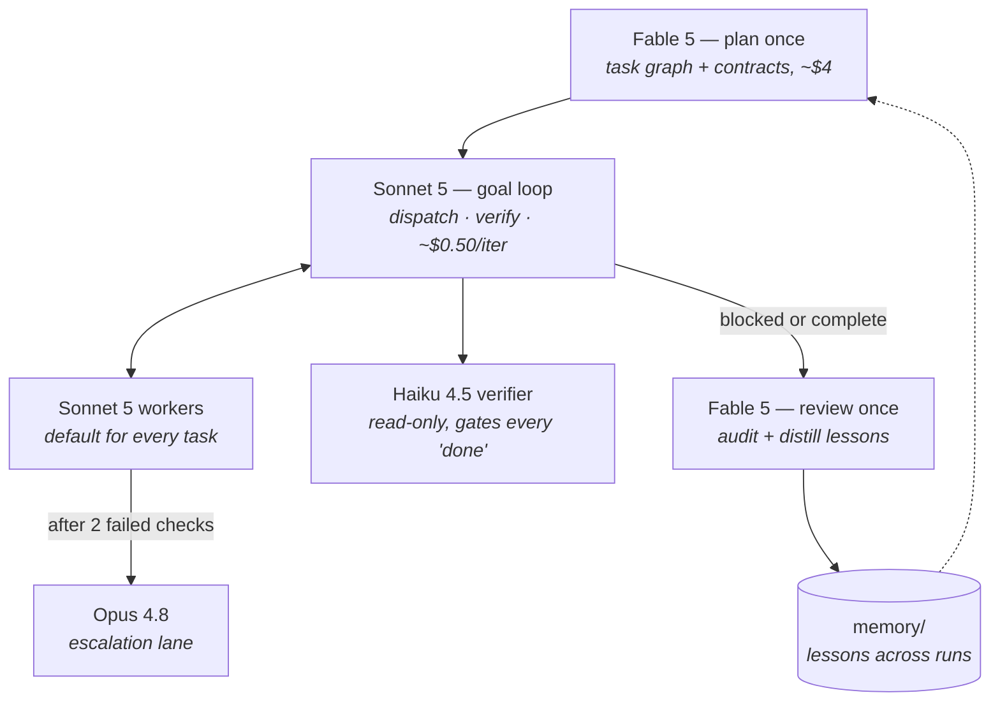

# goalloop

[](LICENSE)
[](https://github.com/gnukum511/goalloop)

**A cost-tiered goal-loop orchestrator for the Claude Agent SDK — frontier intelligence only where it changes outcomes, cheap models everywhere else, and [pxpipe](https://github.com/teamchong/pxpipe) image compression on top.**

Most multi-agent setups put the smartest model in the manager seat — the highest-token-volume job in the system. Every iteration it re-reads the growing context (billed as input) and writes long reasoning (billed as output at frontier rates). goalloop inverts that: the frontier model consults, a cheap model manages, and workers earn their way up an escalation ladder.

## Topology



| Role | Model | Why |
|---|---|---|
| Planner (1 call/run) | Claude Fable 5 | Long-horizon decomposition is where frontier reasoning pays for itself — a bad plan is the most expensive failure in the system |
| Loop orchestrator | Claude Sonnet 5 | Dispatching and bookkeeping against an existing plan is not frontier work |
| Workers (default) | Claude Sonnet 5 | First attempt on everything |
| Escalation lane | Claude Opus 4.8 | Only tasks that failed verification twice — pay Opus rates only for proven-hard work |
| Verifier | Claude Haiku 4.5 | Read-only tools; runs the verify command itself. Workers never self-certify |
| Reviewer (1 call/run) | Claude Fable 5 | Audits seams the narrow per-task checks miss; distills durable lessons into `memory/` |

## Quick start

### Global install (any project)

```bash
git clone https://github.com/gnukum511/goalloop.git
cd goalloop && pnpm run install:global   # → ~/.local/bin/goalloop + GOALLOOP_HOME in ~/.zshrc
```

Then from **any repo**:

```bash
cd /path/to/your/project
export ANTHROPIC_API_KEY=sk-ant-...
goalloop "Build a REST endpoint for X — success when pnpm test exits 0"
goalloop --resume
```

State checkpoints to `./.goalloop/state.json` in the project you run from. Lessons accumulate in `./memory/` across runs.

### Local / dev checkout

```bash
pnpm install
export ANTHROPIC_API_KEY=sk-ant-...

npx tsx src/orchestrator.ts "Build a REST endpoint for X with tests"
npx tsx src/orchestrator.ts --resume     # continue a killed / budget-capped run
```

Every iteration checkpoints to `.goalloop/state.json` — kill the process, fix a blocker, resume. Budget cap via `GOALLOOP_BUDGET_USD` (default 20).

## The pxpipe layer

[pxpipe](https://github.com/teamchong/pxpipe) is a local proxy that renders bulky request context (system prompt, tool docs, older history, large tool results) as dense PNGs. Image token cost is fixed by pixel dimensions, not content — dense text packs ~3.1 chars per image-token vs ~1 char per text-token, and Fable 5 reads the renders at 100/100 on novel-content benchmarks.

```bash
npx pxpipe-proxy &                                    # proxy on 127.0.0.1:47821
ANTHROPIC_BASE_URL=http://127.0.0.1:47821 \
  npx tsx src/orchestrator.ts "your goal"
```

Zero code changes — the Agent SDK's underlying CLI respects `ANTHROPIC_BASE_URL`.

**Why the pairing is safe by construction:**

- pxpipe's default allowlist is Fable 5 (and GPT 5.6) only. The Sonnet loop, Sonnet/Opus workers, and Haiku verifier pass through **byte-identical** — so the goal-state JSON, task graph, contracts, and verify commands are never subject to lossy compression.
- pxpipe is lossy on byte-exact values in *imaged* content (13/15 on 12-char hex for Fable; misses are silent). In goalloop, byte-exact material lives in the non-imaged lanes and in recent turns, which pxpipe always keeps as text.
- pxpipe splices images back cache-friendly — the static prefix is preserved, so prompt caching keeps working. The two levers stack; they don't compete.

## What a run costs

Estimates for a typical 5-task build goal (200K-context plan, 4–6 loop iterations, one review). Model list prices as of July 2026: Fable 5 $10/$50, Opus 4.8 $5/$25, Sonnet 5 $2/$10 (intro) per MTok in/out.

| Setup | Est. cost/run | vs. naive |
|---|---:|---:|
| Naive: Fable 5 orchestrates everything in-loop | $15–40 | — |
| goalloop (inverted tiers + caching + escalation) | $4–8 | **~75% less** |
| goalloop + pxpipe on the Fable calls | $3–6 | **~80–85% less** |

The honest breakdown of the pxpipe increment: goalloop already minimizes Fable 5's token share, so pxpipe's ~60–70% input cut applies only to the plan/review calls' input (~$3 of an ~$8 run) — roughly **20–30% additional savings** here, not the 59–70% headline. The headline applies when Fable 5 carries the whole session (pxpipe's own measurements: $100 → ~$41 end-to-end on a 13,709-request Claude Code snapshot). Run your normal Claude Code workload through the proxy and the two numbers compound: cheap topology for orchestration, image compression for everything Fable touches.

pxpipe logs both sides of every request (billed usage vs. a free `count_tokens` counterfactual) to `~/.pxpipe/events.jsonl` — measure your own workload rather than trusting either headline.

## Design notes

- **Independent verification.** The verifier agent has `Read`/`Bash` only — it cannot edit, so it cannot paper over failures. A task is done when the verifier's command exits 0, not when a worker says so.
- **Two-strike escalation.** `failures >= 2` flips a task's lane from Sonnet to Opus with the failure context attached. Escalation is earned, never default.
- **Fresh context per iteration.** The loop re-invokes with a compact serialized state instead of one ever-growing session — stateless models re-bill the whole context as input every turn, so a small state blob beats a long history.
- **Memory that compounds.** The reviewer distills durable lessons into `memory/lessons.md`; the planner reads the digest on the next run. Anthropic's evals found file-based memory improves Fable 5 ~3× more than it improves Opus 4.8 — the expensive call gets better every run.
- **Cache-shaped prompts.** Stable instructions in `systemPrompt`, volatile state last in the user prompt, so prompt caching hits on the prefix.

## Caveats

- Cost figures are estimates at list prices; Sonnet 5 intro pricing ($2/$10) runs through Aug 31, 2026, then $3/$15.
- pxpipe is workload-dependent and lossy by design — read [its README's "honest part"](https://github.com/teamchong/pxpipe#the-honest-part) before routing byte-exact-critical work through it.
- Subagents cannot spawn subagents in the SDK; the loop must own all delegation.
- `permissionMode: "acceptEdits"` auto-approves file edits. Run in a sandbox or repo you can `git reset`.

## License

MIT — see [LICENSE](LICENSE). Contributions welcome: [CONTRIBUTING.md](CONTRIBUTING.md).
